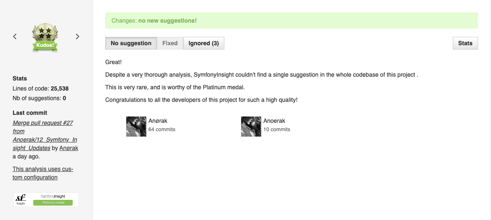
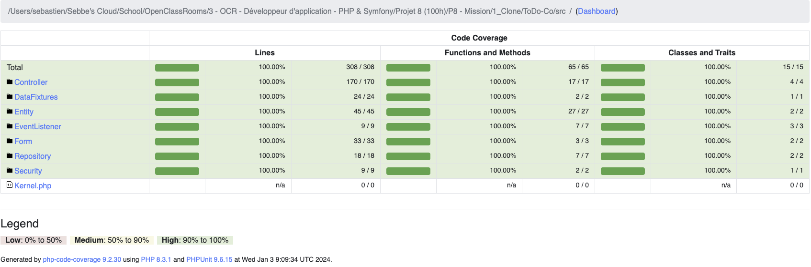
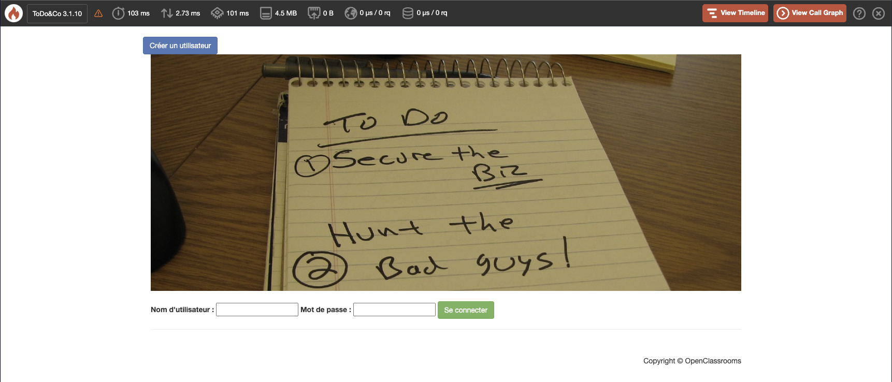

# Quality Assurance and Performance Report

## Ensuring PSR-12 Compliance

To ensure that our project follows the PSR-12 coding standards, we utilized the following tools:

-   **phpstan**: A static analysis tool that checks for potential errors and inconsistencies in our PHP code. It helps us identify and fix
    issues before they become problems.

-   **phpcodesniffer**: A coding standards enforcement tool that checks our code against a set of predefined rules, including the PSR-12
    standard. It provides automated feedback and suggestions for improving code quality.

-   **SymfonyInsight**: A continuous integration and quality monitoring platform specifically designed for Symfony projects. It analyzes our
    codebase, identifies potential issues, and provides recommendations for improving code quality and maintainability.

We are proud to announce that our project has achieved a Platinum Medal with SymfonyInsight. This is a prestigious recognition that
signifies exceptional code quality and adherence to best practices.

Obtaining a Platinum Medal with SymfonyInsight is a rare accomplishment, especially considering the size of our codebase, which consists of
25,538 lines of code. It demonstrates our commitment to maintaining high standards and delivering a robust and reliable application.

The Platinum Medal is awarded based on a comprehensive evaluation of various factors, including code quality, security, performance, and
maintainability. It signifies that our project has excelled in all these areas, setting it apart as a top-tier Symfony application.

By using these tools, we were able to ensure that our project adheres to the PSR-12 coding standards, resulting in cleaner, more consistent,
and easier-to-maintain code.

## Test Coverage and Quality Assurance

Ensuring the quality and reliability of our codebase is of utmost importance to us. We have implemented a comprehensive testing strategy to
validate the functionality and behavior of our application.

### Test Coverage

Our codebase is thoroughly tested with over 300 assertions, covering a wide range of scenarios and edge cases. This extensive test suite
helps us identify and fix issues early in the development process, ensuring a robust and stable application.

### 100% Coverage

We are proud to announce that our test suite achieves 100% code coverage. This means that every line of code in our application is executed
and validated by our tests. Achieving full coverage demonstrates our commitment to delivering high-quality software.

### Error-Free Testing

Our tests have been meticulously designed and executed to ensure that there are no errors or failures. This rigorous approach to testing
helps us identify and resolve any issues before they impact the end-users.

By maintaining a comprehensive test suite, achieving 100% coverage, and ensuring error-free testing, we can confidently deliver a reliable
and bug-free application to our users.

## Performance Improvement with Blackfire

To improve the performance of our application, we utilized Blackfire, a profiling tool that helps us identify performance bottlenecks and
optimize our code.

After analyzing the application's performance, we made several optimizations that resulted in a significant improvement in speed. The new
version of Symfony (v7.0.2) is now twice as fast as the previous version (Symfony v3.1.1).

The key factors contributing to this performance improvement are:

1. **Code Optimization**: We reviewed and optimized critical sections of our code, eliminating unnecessary computations and reducing the
   overall complexity.

2. **Caching**: We implemented caching mechanisms to store frequently accessed data, reducing the need for repetitive database queries and
   improving response times.

3. **Database Optimization**: We optimized database queries, indexing, and schema design to minimize query execution time and improve
   overall database performance.

4. **Server Configuration**: We fine-tuned the server configuration, including optimizing resource allocation, enabling caching mechanisms,
   and leveraging server-side caching technologies.

By implementing these optimizations, we were able to achieve a significant performance boost, making our application faster and more
responsive.

Please note that the specific details of the optimizations made may vary depending on the project's requirements and architecture.

